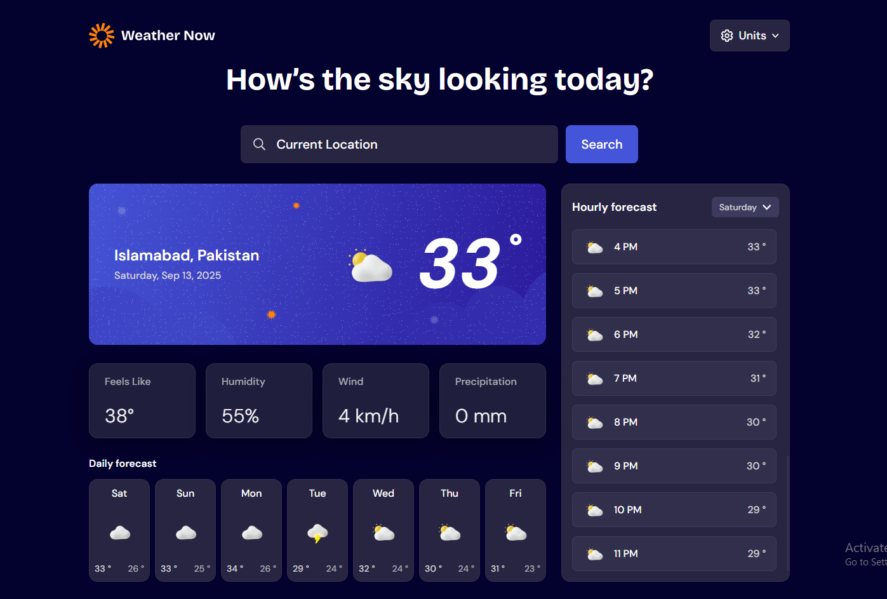

# Frontend Mentor - Weather app solution

This is a solution to the [Weather app challenge on Frontend Mentor](https://www.frontendmentor.io/challenges/weather-app-K1FhddVm49). Frontend Mentor challenges help you improve your coding skills by building realistic projects.

## Table of contents

- [Overview](#overview)
  - [The challenge](#the-challenge)
  - [Screenshot](#screenshot)
  - [Links](#links)

- [Getting started](#getting-started)
- [APIs (Backend layer)](#apis-backend-layer)
  - [External APIs used](#external-apis-used)
  - [App API routes](#app-api-routes)

- [My process](#my-process)
  - [Built with](#built-with)
  - [What I learned](#what-i-learned)
  - [Continued development](#continued-development)
  - [Useful resources](#useful-resources)

- [Author](#author)
- [Acknowledgments](#acknowledgments)

---

## Overview

A modern, responsive weather app built with Next.js (App Router) and Tailwind CSS. Search any city or use your current location to see live conditions (temperature, “feels like”, humidity, wind, precipitation), an hourly forecast with a day selector, and a clean 7-day outlook. Unit toggles let you switch between °C/°F, km/h/mph, and mm/inch.

### The challenge

Users should be able to:

- Search for weather information by entering a location in the search bar
- View current weather conditions including temperature, weather icon, and location details
- See additional weather metrics like "feels like" temperature, humidity percentage, wind speed, and precipitation amounts
- Browse a 7-day weather forecast with daily high/low temperatures and weather icons
- View an hourly forecast showing temperature changes throughout the day
- Switch between different days of the week using the day selector in the hourly forecast section
- Toggle between Imperial and Metric measurement units via the units dropdown
- Switch between specific temperature units (Celsius/Fahrenheit), wind (km/h, mph, m/s, kn), and precipitation (mm/inch)
- View the optimal layout for the interface depending on their device's screen size
- See hover and focus states for all interactive elements on the page

### Screenshot




### Links

- Solution URL: [https://my-solution-url.com](https://my-solution-url.com)
- Live Site URL: [https://my-live-site-url.com](https://my-live-site-url.com)

---

## Getting started

```bash
# Install
pnpm install  # or npm/yarn

# Run dev server
pnpm dev      # http://localhost:3000

# Try these in your browser/Postman:
# /api/geocode?q=Lahore&lang=en
# /api/weather?lat=31.5204&lon=74.3587&tUnit=celsius&wUnit=kmh&pUnit=mm&days=7&tz=auto
```

Project structure (relevant parts):

```
app/
  api/
    geocode/route.ts         # name → places (forward geocoding)
    reverse-geocode/route.ts # coords → place label (reverse geocoding)
    weather/route.ts         # current + hourly + 7-day with unit toggles
public/
  assets/
    fonts/                   # custom fonts
    images/                  # UI images
  design/                    # challenge designs & screenshots
```

---

## APIs (Backend layer)

This app uses a small server layer (Next.js routes) to keep the frontend simple. The server calls Open-Meteo, selects only the variables needed, handles unit toggles, time zones, and adds light caching.

### External APIs used

* **Forecast:** `https://api.open-meteo.com/v1/forecast`
* **Forward geocoding (search):** `https://geocoding-api.open-meteo.com/v1/search`
* **Reverse geocoding (coords → label):** `https://geocoding-api.open-meteo.com/v1/reverse`

### App API routes

#### `GET /api/geocode`

**Purpose:** Search by place name to get candidates with `latitude`, `longitude`, and `timezone`.

- **Params:**
  `q` (string, required), `lang` (default `en`), `count` (default `10`)
- **Example:**
  `/api/geocode?q=Berlin&lang=en&count=10`
- **Returns:** `{ results: [{ name, latitude, longitude, country, admin1, timezone, ... }] }`
- **Use in UI:** power the search bar/autocomplete; on select, pass `lat/lon` to `/api/weather`.

#### `GET /api/reverse-geocode`

**Purpose:** Convert GPS coordinates into a friendly label (City, Region, Country).

- **Params:**
  `lat` (required), `lon` (required), `lang` (default `en`)
- **Example:**
  `/api/reverse-geocode?lat=52.52&lon=13.41&lang=en`
- **Use in UI:** “Use my location” button and the location header.

#### `GET /api/weather`

**Purpose:** One call that returns **current**, **hourly**, and **daily** data, already formatted to the user’s chosen units.

- **Required params:** `lat`, `lon`

- **Optional params:**
  - `tUnit=celsius|fahrenheit` (default `celsius`)
  - `wUnit=kmh|mph|ms|kn` (default `kmh`)
  - `pUnit=mm|inch` (default `mm`)
  - `days=7` (up to `16`)
  - `tz=auto` (local times for the selected place)
  - `minutely=1` (optional: adds 15-min data where available)

- **Examples:**
  Metric → `/api/weather?lat=31.5204&lon=74.3587&tUnit=celsius&wUnit=kmh&pUnit=mm&days=7&tz=auto`
  Imperial → `/api/weather?lat=31.5204&lon=74.3587&tUnit=fahrenheit&wUnit=mph&pUnit=inch`

- **Key fields the UI reads:**
  - `current`: `temperature_2m`, `apparent_temperature` (feels like), `relative_humidity_2m`, `precipitation`, `weather_code`, `wind_speed_10m`, `wind_direction_10m`, `is_day`, `time`
  - `hourly`: arrays for `time`, `temperature_2m`, `apparent_temperature`, `precipitation`, `precipitation_probability`, `weather_code`, `wind_*`
  - `daily`: arrays for `time`, `weather_code`, `temperature_2m_max/min`, `precipitation_sum`, `precipitation_probability_max`, `sunrise`, `sunset`
  - `*_units`: unit labels that **match the returned values** (so the UI never hardcodes “°C”, “mph”, etc.)

- **Notes:**
  - `timezone=auto` ensures timestamps are returned in the location’s local time.
  - The route requests only the variables needed by the design to keep payloads small.
  - Light caching (`revalidate`) keeps responses snappy without stale data.

---

## My process

### Built with

- Semantic HTML5 + Accessible patterns (focus rings, aria labels)
- **Next.js (App Router) + TypeScript**
- **Tailwind CSS**
- Mobile-first, responsive layout

### What I learned

- **Unit handling:** Open-Meteo returns `current_units/hourly_units/daily_units` so the UI can always display the correct unit labels after a toggle (no hardcoding).
- **Time zones:** With `tz=auto`, API timestamps are already local to the searched place—formatting becomes straightforward.
- **Data modeling:** Hourly arrays are parallel; grouping by `hourly.time[i].slice(0,10)` yields the per-day hourly view.
- **Weather codes:** Mapping WMO `weather_code` → icon/label keeps the UI expressive without extra endpoints.

### Continued development

- PWA + offline (cache last viewed city)
- Favorites & quick compare
- i18n/RTL support
- Tiny charts for hourly temp/precip
- Shareable deep links and widgets

### Useful resources

- Open-Meteo API Docs – [https://open-meteo.com/en/docs](https://open-meteo.com/en/docs)
- MDN `Intl.DateTimeFormat` – time zone & locale formatting
- WMO Weather Codes (reference for icons/labels)

---

## Author

- Name: Sohaib Shah
- Frontend Mentor: [https://www.frontendmentor.io/profile/Turbosohaib](https://www.frontendmentor.io/profile/Turbosohaib)
- Twitter X: [https://x.com/HamzaKhan36557](https://x.com/HamzaKhan36557)
- LinkedIn: [https://www.linkedin.com/in/sohaib-shah-b44a65270/](https://www.linkedin.com/in/sohaib-shah-b44a65270/)
- Website: [https://sohaibportfoliov1.vercel.app/](https://sohaibportfoliov1.vercel.app/),[https://sohaibportfoliov2.vercel.app/](https://sohaibportfoliov2.vercel.app/)

---

## Acknowledgments

Thanks to the Frontend Mentor community for feedback and inspiration, and to Open-Meteo for providing a free, well-documented API.
